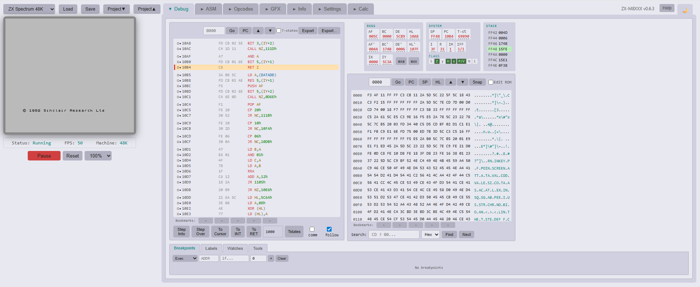
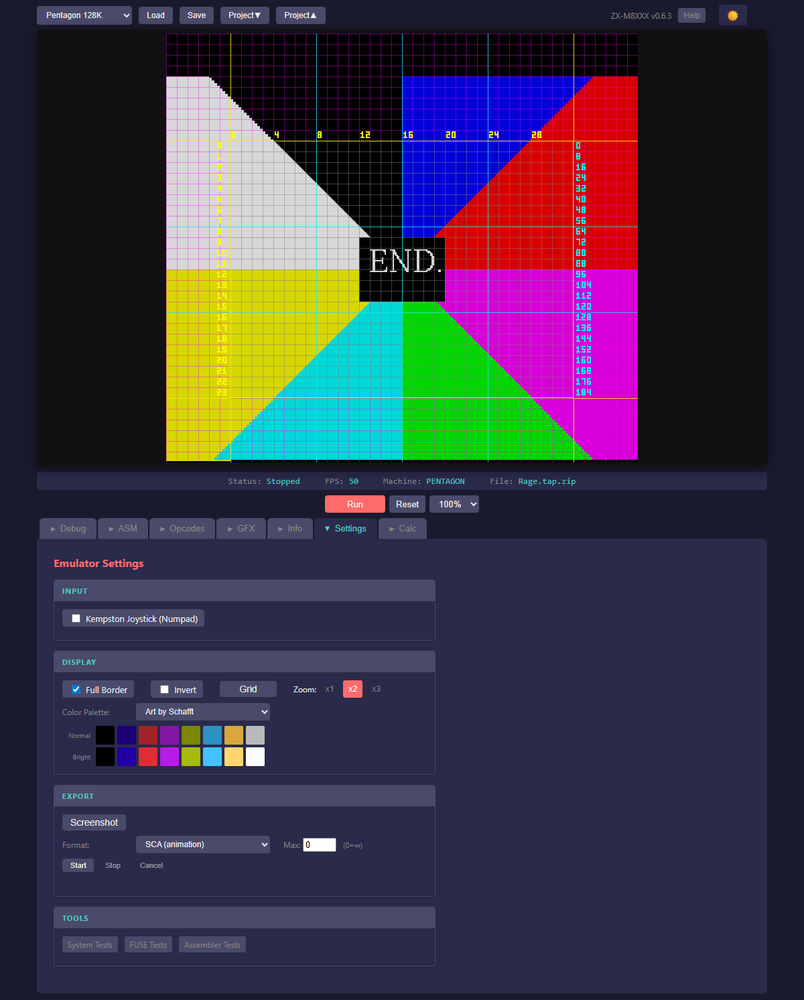

# ZX-M8XXX

**Version 0.9.27** | [Changelog](CHANGELOG.md)

ZX-M8XXX (ZX Matrix) is a vanilla JavaScript ZX Spectrum emulator with an integrated debugger designed for reverse engineering and development. No build tools, no dependencies - just open `index.html` in your browser.

## Features

### Emulation
- Full Z80 CPU emulation (all documented + undocumented opcodes)
- 48K, 128K, +2, +2A, +3, Pentagon, Pentagon 1024, and Scorpion ZS 256 machine support
- Memory banking and contention emulation
- Pixel-perfect ULA video timing with border effects
- ULAplus extended palette (64 colors, HAM256 raster effects)
- AY-3-8910 sound chip emulation (stereo modes: Mono/ABC/ACB)
- PSG file export (record AY music with player source)
- SNA/Z80/SZX snapshot loading/saving
- TAP/TZX tape loading (instant or real-time with border stripes and sound)
- Auto Load: automatic LOAD "" for tapes, TR-DOS boot for disks (turbo block handoff)
- TRD/SCL disk image support (TR-DOS format) with boot injection
- DSK disk image support (+3 µPD765 FDC, standard and extended CPC DSK format)
- Multi-drive support: BetaDisk 4 drives (A-D), FDC 2 drives (A-B), simultaneous tape+disk
- ZIP archive support
- RZX playback
- Kempston Joystick (numpad) with extended buttons support
- Kempston Mouse with wheel support
- Hardware gamepad support (USB/Bluetooth via Gamepad API)
- Keyboard: Ctrl=Caps Shift, Alt=Symbol Shift (works with any layout)

### Debugger
- Unified breakpoint system (execution, memory read/write, port I/O)
- Execution trace with history navigation (10,000 instructions)
- Memory region marking (code/data/text/graphics)
- Auto memory mapping (detect regions during execution)
- Memory heatmap visualization
- Labels with import/export
- Cross-references (XRefs) tracking
- Subroutine detection and marking
- Code folding (collapse/expand subroutines and custom blocks)
- Bookmarks for quick navigation
- Undo/Redo support
- Pattern search with wildcards
- Project save/load (complete session state)

### Assembler
- Integrated Z80 assembler (sjasmplus-compatible)
- Multi-file projects with virtual file system
- Syntax highlighting
- Search/replace across all files
- Output: SAVEBIN, SAVESNA, SAVETAP
- MD5 checksum verification
- Debug injection at entry point

### Tools
- Graphics Viewer for sprite search
- Memory Watches (up to 10 addresses)
- Text Scanner for string search
- Programmer Calculator (hex/dec/oct/bin)
- Compare Tool (snapshots, binaries, emulator state)
- Explorer (TAP, TZX, SNA, Z80, SZX, RZX, TRD, SCL, DSK, ZIP — BASIC decoder, disassembly, hex dump)
- Z80 Opcodes reference

## Quick Start

1. Place ROM files in `roms/` directory:
   - `48.rom` - ZX Spectrum 48K (16KB, required)
   - `128.rom` - ZX Spectrum 128K (32KB, optional)
   - `plus2.rom` - ZX Spectrum +2 (32KB, optional)
   - `plus2a.rom` - ZX Spectrum +2A (64KB, optional)
   - `plus3.rom` - ZX Spectrum +3 (64KB, optional)
   - `pentagon.rom` - Pentagon 128K (32KB, optional)
   - `scorpion.rom` - Scorpion ZS 256 (64KB, optional)
   - `trdos.rom` - TR-DOS 5.03/5.04t (16KB, for disk images)
2. Open `index.html` in a modern browser
3. Click **Help** button for comprehensive documentation

## File Formats

| Format | Description |
|--------|-------------|
| DSK | +3 disk image (standard and extended CPC DSK) |
| RZX | Input recording |
| SCL | TR-DOS file archive |
| SNA | Snapshot (48K/128K) |
| SZX | Spectaculator snapshot format |
| TAP | Tape format (instant or real-time loading) |
| TRD | TR-DOS disk image |
| TZX | Extended tape format (turbo, pure tone, loops) |
| Z80 | Snapshot (v1, v2, v3 with compression) |
| ZIP | Archive support |

## Known Limitations

- **Real-time tape loading** (work in progress): Some copy protection schemes work, others don't yet. Standard loaders and many turbo loaders work; complex protection may fail. Flash load (instant) mode is more reliable.
- **RZX playback**: Partial support - some recordings may desync due to timing differences
- **Z80 save uncompressed**: Z80 snapshots are saved without RLE compression for maximum compatibility (~131KB for 128K, ~49KB for 48K)
- **ULAplus raster effects**: HAM256 and similar multi-entry palette effects work correctly. Per-scanline effects (like ULAplusDemo border stripes) may show minor paper/border desync at edges.

## License

GPL-3.0

**Test Programs:** The test programs in the `tests/` folder (z80ccf, z80doc, z80docflags, etc.) are copyright of their respective authors and included for emulator validation purposes only.

## Credits

Based on Z80 documentation and Fuse emulator behavior.

Inspired by: JSSpeccy 3, EmuzWin, Swan, ZXMAK2

## Screenshots

### Games

&nbsp;

&nbsp;

&nbsp;

